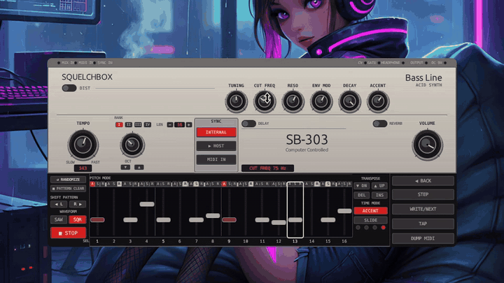
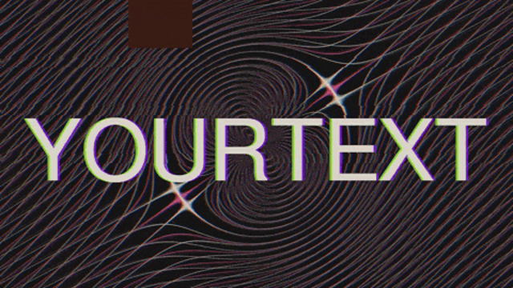
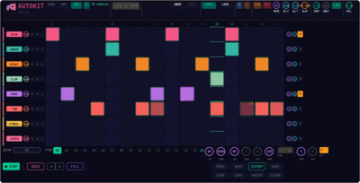

  
  
  
  
  
  

### Projects

[**squelchbox**](https://github.com/Hornfisk/squelchbox) — TB-303-style acid bassline synth · 3-pole diode ladder filter · 16-step sequencer · slide/accent/swing · Rust + nih-plug · VST3 / CLAP / Standalone · runs on any modern CPU, no GPU needed · [hear it in your browser](https://hornfisk.github.io/squelchbox/)

[**vgalizer**](https://github.com/Hornfisk/vgalizer) — GPU-accelerated audio-reactive DJ visualizer · 25 WGSL shader effects · beat-locked · live TUI editor · Rust + wgpu

downscaled — real output in full HD

[**Autokit**](https://github.com/Hornfisk/autokit) — drum machine plugin · scans your sample library, classifies by type, plots on a 2D map · Digitakt-style sequencer · VST3 / CLAP / Standalone

[**Slammer**](https://github.com/Hornfisk/slammer) — synthesized kick drum + clap · three-layer engine, five distortion modes, master bus chain · [hear it in your browser](https://hornfisk.github.io/slammer/) · VST3 / CLAP / Standalone

